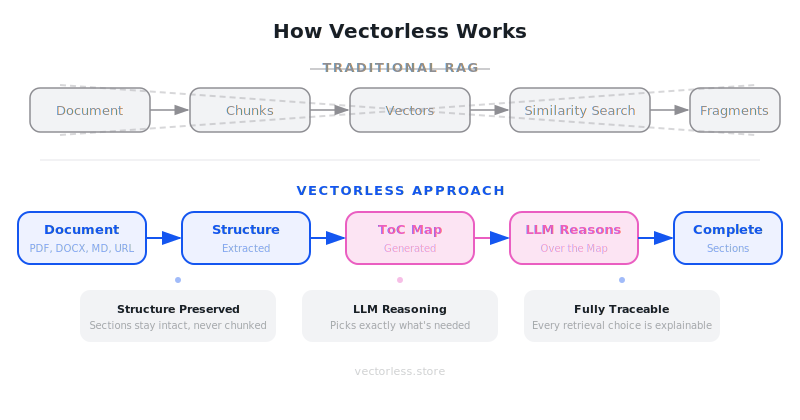
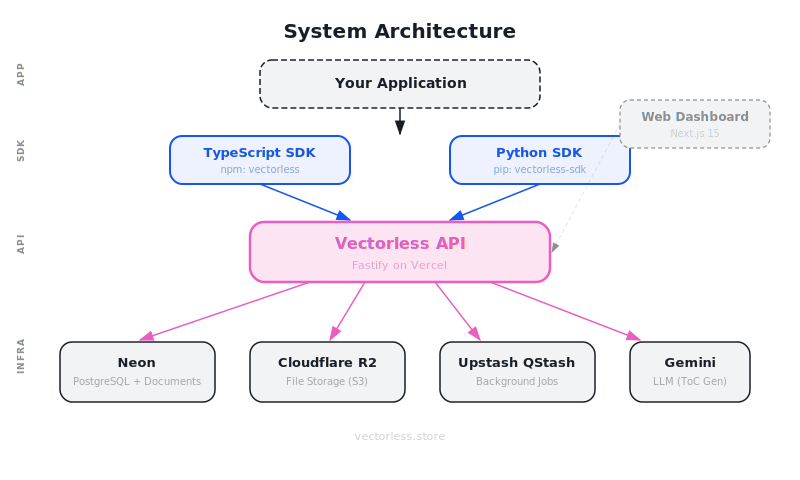
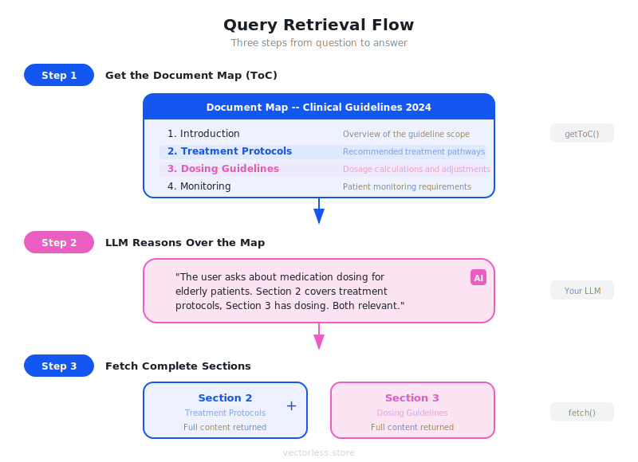

<div align="center">

# Vectorless

**Document retrieval for the reasoning era.**

[](https://github.com/hallelx2/vectorless/actions/workflows/ci.yml)
[](https://github.com/hallelx2/vectorless/actions/workflows/deploy-web.yml)
[](https://www.npmjs.com/package/vectorless)
[](https://pypi.org/project/vectorless-sdk/)
[](https://opensource.org/licenses/MIT)
[](https://www.typescriptlang.org/)
[](https://python.org)
[](https://nextjs.org)
[](https://fastify.dev)

[Website](https://vectorless.store) | [npm](https://www.npmjs.com/package/vectorless) | [PyPI](https://pypi.org/project/vectorless-sdk/)

</div>

---

## What is Vectorless?

Vectorless is a document retrieval platform that replaces traditional RAG chunking with **structure-preserving retrieval**. Instead of splitting documents into arbitrary chunks and using vector similarity search, Vectorless:

1. **Preserves document structure** -- sections, headings, chapters stay intact
2. **Generates navigable document maps** -- a Table of Contents with summaries for each section
3. **Lets LLMs reason** over the map to select exactly the sections they need

The result: more accurate retrieval, complete context, and every choice is traceable.

## How It Works

<div align="center">



</div>

Traditional RAG shatters documents into arbitrary chunks and relies on vector similarity -- a black box that destroys structure and loses context. Vectorless takes a fundamentally different approach:

| | Traditional RAG | Vectorless |
|---|----------------|------------|
| **Splitting** | Arbitrary chunks | Natural sections |
| **Retrieval** | Vector similarity | LLM reasoning |
| **Structure** | Destroyed | Preserved |
| **Traceability** | Black box ranking | Every choice explainable |
| **Context** | Fragments | Complete sections |

## Architecture

<div align="center">



</div>

Vectorless is designed as a modular stack. Your application talks to the API through one of the official SDKs (TypeScript or Python). The API orchestrates document processing across four infrastructure services:

- **Neon (PostgreSQL)** -- stores documents, sections, ToC maps, and metadata
- **Cloudflare R2** -- holds uploaded document files (S3-compatible)
- **Upstash QStash** -- manages background jobs for async document processing
- **Gemini / Claude** -- LLM used to generate summaries and ToC maps

## The Retrieval Flow

<div align="center">



</div>

Retrieval happens in three steps:

1. **Get the Document Map** -- call `getToC()` to receive a structured Table of Contents with section titles, summaries, and IDs. This is lightweight metadata, not the full content.

2. **LLM Reasons Over the Map** -- pass the ToC to your LLM along with the user's query. The LLM reads the summaries and selects exactly the sections relevant to the question. Every choice is visible and explainable.

3. **Fetch Complete Sections** -- call `fetchSections()` with the IDs your LLM selected. You get back full, unbroken section content -- no fragments, no missing context.

## Quick Start

### TypeScript

```bash
npm install vectorless
```

```typescript
import { VectorlessClient } from "vectorless";

const client = new VectorlessClient({ apiKey: "vl_sk_live_..." });

// Upload a document
const { doc_id, toc } = await client.addDocument(file, {
  tocStrategy: "hybrid",
});

// Get the document map
const toc = await client.getToC(doc_id);
for (const section of toc.sections) {
  console.log(`${section.title}: ${section.summary}`);
}

// Fetch specific sections (after your LLM picks them)
const sections = await client.fetchSections(doc_id, ["section-1", "section-2"]);
```

### Python

```bash
pip install vectorless-sdk
```

```python
from vectorless import VectorlessClient

client = VectorlessClient(api_key="vl_sk_live_...")

# Upload a document
result = client.add_document("report.pdf", options=AddDocumentOptions(
    toc_strategy="hybrid",
))

# Get the document map
toc = client.get_toc(result.doc_id)
for section in toc.sections:
    print(f"{section.title}: {section.summary}")

# Fetch specific sections
sections = client.fetch_sections(result.doc_id, ["section-1", "section-2"])
```

## ToC Strategies

| Strategy | When to Use | LLM Required |
|----------|------------|-------------|
| **extract** | Documents with clear headings (PDF with bookmarks, Markdown with `#` headings) | No |
| **hybrid** | Headings exist but summaries need to be precise for retrieval | Yes |
| **generate** | Unstructured documents with no headings | Yes |

## Supported Formats

- **PDF** -- text extraction + heading detection from structure and font patterns
- **DOCX** -- heading hierarchy from Word styles
- **Markdown / TXT** -- `#` headings, setext headings, ALL CAPS detection
- **URL** -- fetches HTML, strips navigation, extracts heading structure

## SDK Reference

### TypeScript SDK (`vectorless`)

| Method | Description |
|--------|-------------|
| `addDocument(source, options?)` | Upload and ingest a document |
| `getToC(docId)` | Get the Table of Contents manifest |
| `fetchSection(docId, sectionId)` | Fetch a single section |
| `fetchSections(docId, sectionIds)` | Batch fetch multiple sections |
| `getDocument(docId)` | Get document status and metadata |
| `listDocuments(options?)` | List all documents |
| `deleteDocument(docId)` | Delete a document and all sections |

### Python SDK (`vectorless-sdk`)

| Method | Description |
|--------|-------------|
| `add_document(source, options?)` | Upload and ingest a document |
| `get_toc(doc_id)` | Get the Table of Contents manifest |
| `fetch_section(doc_id, section_id)` | Fetch a single section |
| `fetch_sections(doc_id, section_ids)` | Batch fetch multiple sections |
| `get_document(doc_id)` | Get document status and metadata |
| `list_documents(options?)` | List all documents |
| `delete_document(doc_id)` | Delete a document and all sections |

Both SDKs also support async clients. The Python SDK provides `AsyncVectorlessClient`.

## Project Structure

```
vectorless/
  apps/
    web/         # Next.js dashboard + marketing site
    api/         # Fastify REST API server
  packages/
    shared/      # Shared TypeScript types + Zod schemas
    ts-sdk/      # TypeScript SDK (npm: vectorless)
    openapi/     # OpenAPI 3.1 specification
  sdks/
    python/      # Python SDK (PyPI: vectorless-sdk)
  docs/          # SVG diagrams and documentation assets
```

## Self-Hosting

Vectorless can be self-hosted. You need:

- **PostgreSQL** with pgvector (we recommend [Neon](https://neon.tech))
- **Cloudflare R2** or any S3-compatible storage for document files
- **Upstash QStash** for background job processing
- **Gemini** (Vertex AI) or **Anthropic** (Claude) for ToC generation

See the [Deployment Guide](./DEPLOYMENT.md) for step-by-step instructions.

## BYOK (Bring Your Own Key)

Users can configure their own LLM API keys in the dashboard. Keys are encrypted with AES-256-GCM before storage and are never exposed in logs or responses. If no BYOK key is configured, the platform's default LLM is used.

## Contributing

Contributions are welcome. Please open an issue first to discuss what you'd like to change.

## License

MIT
